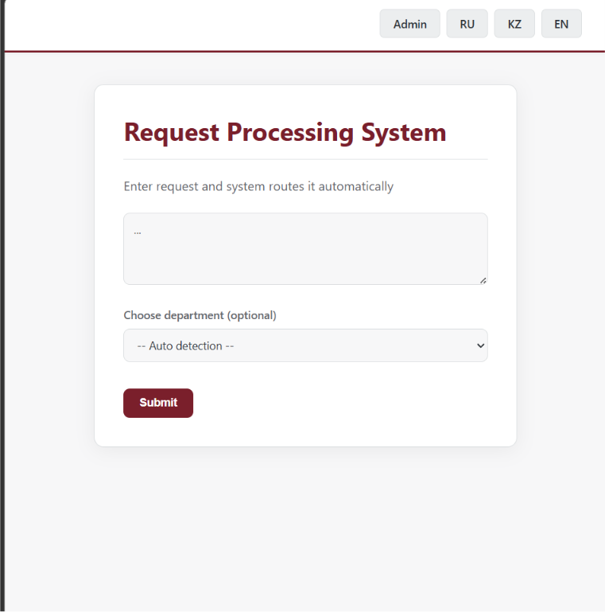
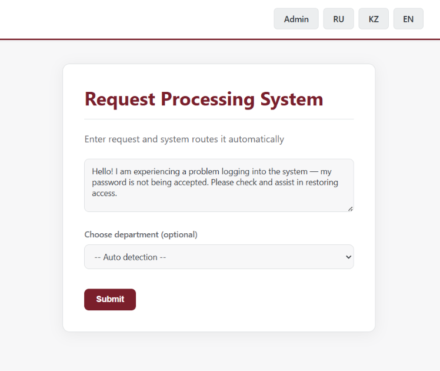
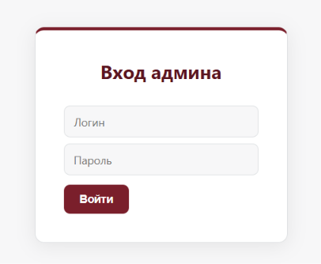
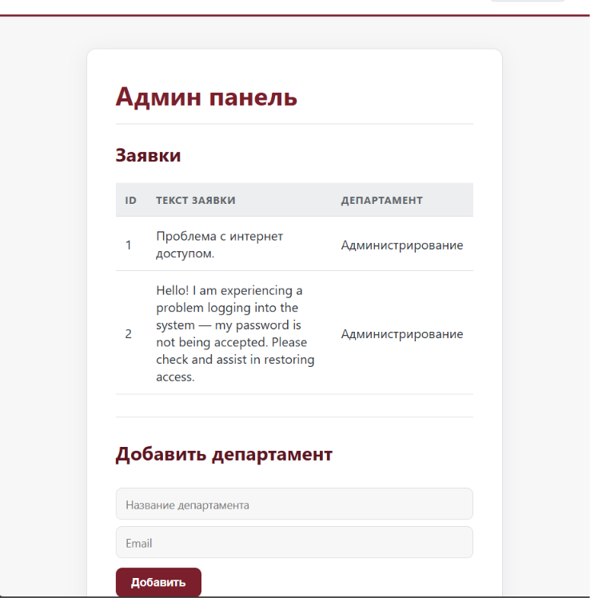
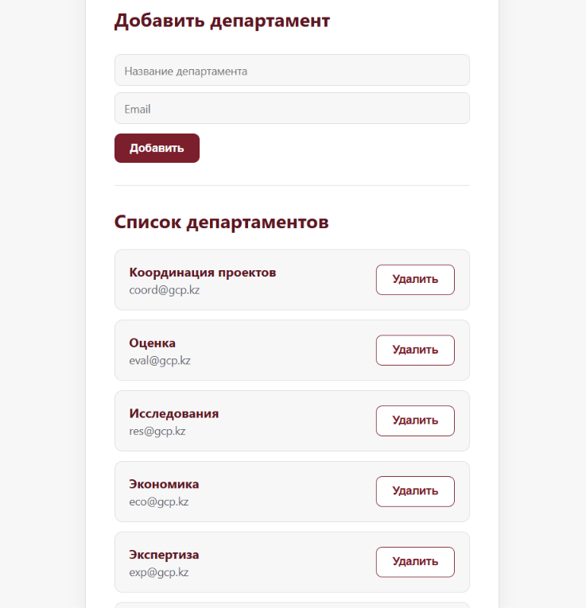

# Smart Request Routing System

Интеллектуальная система обработки заявок на основе правил (rule-based) с автоматическим определением департамента. / Ережелерге негізделген өтінімдерді өңдеу жүйесі, департаментті автоматты анықтайды. / A rule-based intelligent request-processing system with automatic department detection.

---

## 🇰🇿 Қазақша

### Жоба туралы

Бұл — Flask негізінде жасалған веб-қосымша, ол пайдаланушылардан өтінімдерді қабылдап, өтінім мәтініндегі кілт сөздер бойынша тиісті департаментті автоматты түрде анықтайды және оны әкімшіге өңдеуге жібереді. Көптілді интерфейсті (RU/KZ/EN), әкімшілік панельді және PostgreSQL деректер базасын қолдайды.

### Мүмкіндіктері

- Қарапайым веб-форма арқылы өтінім жіберу
- Өтінім мәтіні бойынша департаментті автоматты анықтау (ережелерге негізделген, IF–THEN)
- Автоматты анықтау қажет болмаған жағдайда департаментті қолмен таңдау мүмкіндігі
- Логин жүйесі арқылы әкімші кірісі
- Әкімшілік панельде барлық келіп түскен өтінімдерді қарау
- Департаменттерді басқару: қосу және жою
- Көптілді интерфейс: қазақ, орыс, ағылшын тілдері

### Скриншоттар

**Басты бет**

**Пайдаланушының өтінім жіберу мысалы**

**Әкімшінің кіруі**

**Департаменті автоматты анықталған өтінім**

**Департаменттер тізімін басқару**

### Технологиялар

- **Backend:** Python, Flask
- **Деректер базасы:** PostgreSQL
- **Frontend:** HTML, CSS
- **Хостинг:** Render.com

  ***

## 🇬🇧 English

### About

A Flask-based web application that accepts user requests, automatically detects the relevant department based on keywords in the request text, and routes it to the administrator for processing. Supports a multilingual interface (RU/KZ/EN), an admin panel, and a PostgreSQL database.

### Features

- Submit a request through a simple web form
- Automatic department detection based on request text (rule-based, IF–THEN)
- Option to manually select a department when needed
- Admin login system
- View all incoming requests in the admin panel
- Manage departments: add and remove
- Multilingual interface: Russian, Kazakh, English

### Screenshots

**Home page**

**Example of a user submitting a request**

**Admin login**

**Request with auto-detected department**

**Department list management**

### Tech Stack

- **Backend:** Python, Flask
- **Database:** PostgreSQL
- **Frontend:** HTML, CSS
- **Hosting:** Render.com

---

## 📄 License

This project was developed as part of an internship (өндірістік практика) at АО «Казахстанский центр ГЧП».

---

## 🇷🇺 Русский

### О проекте

Веб-приложение на Flask, которое принимает заявки от пользователей, автоматически определяет нужный департамент по ключевым словам в тексте обращения и направляет заявку администратору на обработку. Поддерживает многоязычный интерфейс (RU/KZ/EN), панель администратора и базу данных PostgreSQL.

### Возможности

- Подача заявки через простую веб-форму
- Автоматическое определение департамента по тексту обращения (rule-based, IF–THEN)
- Возможность выбрать департамент вручную, если авто-определение не требуется
- Вход администратора через систему логина
- Просмотр всех поступивших заявок в панели администратора
- Управление департаментами: добавление и удаление
- Многоязычный интерфейс: русский, казахский, английский

### Скриншоты

**Главная страница**

**Пример отправки заявки от пользователя**

**Вход администратора**

**Заявка с автоматически определённым департаментом**

**Управление списком департаментов**

### Технологии

- **Backend:** Python, Flask
- **База данных:** PostgreSQL
- **Frontend:** HTML, CSS
- **Хостинг:** Render.com
